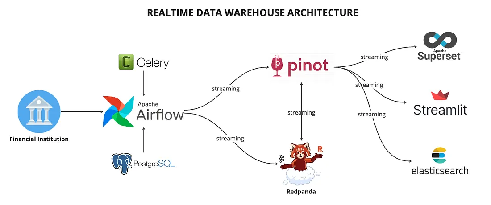

# Real-Time Data Warehousing: Why It Matters

### Introduction

In today's fast-paced world, decision-making can't wait. Businesses need to react instantly to changing situations, especially when dealing with high-volume transactions. Imagine managing an online retail store where thousands of transactions are happening every minute. Relying on yesterday's data for pricing adjustments or inventory management means you're already a step behind.

This is where real-time data warehousing comes into play, enabling businesses to make decisions based on what is happening right now, rather than on outdated information.

### The Problem with Traditional Data Warehouses
Traditional data warehouses were built around periodic updates—think of overnight batch jobs processing data to refresh reports by morning.
This worked well when decisions could afford to wait. However, the modern business environment demands up-to-the-second insights to remain competitive.

## About This Project

This project explores an example of a  real-time data warehouse architecture, using tools and technologies in the modern data stack that one can utilise.
By understanding how to implement a real-time data warehouse, you will gain insights into creating a responsive data platform for real-time analytics workload suitable for today's dynamic analytical landscape.

### Architecture Diagram
[]

## Tech Stack

In this project, we will be leveraging the following key components:

- Apache Airflow: An open-source workflow orchestration tool used to author, schedule, and monitor workflows. Airflow allows you to define workflows as Directed Acyclic Graphs (DAGs), making it easier to schedule complex ETL processes, manage dependencies, and monitor real-time data pipelines.

- Redpanda: A Kafka-compatible distributed streaming platform, optimized for lower latency and simpler deployments. Redpanda is employed to construct real-time data pipelines, providing high throughput and low latency.

- Apache Pinot: A real-time distributed OLAP datastore designed for low-latency analytics on event streams. It can handle both streaming and historical data, making it ideal for real-time data warehousing.

- Apache Superset: An open-source data exploration and visualization tool. Superset provides a user-friendly interface with excellent dashboard and chart creation capabilities, perfect for displaying real-time data from Pinot.

- Docker: A software platform that enables developers to build, test, and deploy applications quickly. It packages software into standardized units called containers, which include all dependencies needed for the application to run consistently in different environments.

